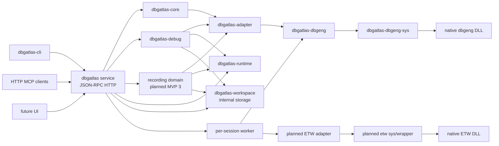

# DbgAtlas 架构

DbgAtlas 是面向 Windows 的调试、逆向、事件录制与问题分析平台。源码仓库产出工具本身，不承载真实分析数据；真实分析数据放在显式 analysis workspace 中。

## 分层

`dbgatlas service` 是产品运行时控制面。CLI、HTTP MCP 和后续 UI 都是 service client，不是架构核心。对外 API 使用 JSON-RPC 2.0 over loopback HTTP，默认要求 bearer token；`/rpc` 承载 DbgAtlas 自有 JSON-RPC API，`/mcp` 承载 MCP JSON-RPC HTTP endpoint。长操作可以通过 HTTP streaming/SSE 返回 progress/output，但取消必须显式请求，断线不等于取消。

对外 API 不暴露 `workspace.*`、`project.*` 或 `worker.*` 业务资源。调用方在创建 session 时传入 `project_root`；service 内部把它解析为 `<project_root>/dbgatlas` 作为 analysis workspace，并懒创建该目录。`workspace` 仍是内部持久化模型，负责 manifest、artifact metadata、operation log 和受控 artifact path。

`session` 是公开生命周期对象，`worker` 是内部运行时对象。MVP 默认一个 session 绑定一个 worker；创建 session 时创建 worker，关闭或 kill session 时结束对应 worker。worker 由 service 的 Windows Job Object 管理，service 退出时 worker 不应残留。

`dbgatlas-debug` 代表 debug domain manager 边界：它定义 target、session、command 和状态模型，但 MVP 0.5 不接真实 DbgEng session。后续 DbgEng、TTD、dump eval 等能力由这个 domain manager 编排 runtime、workspace 和具体 adapter/native wrapper。

`recording` 代表事件录制 domain 边界。MVP 3 先以 ETW API 为主线，公开 `recording.*` lifecycle，内部通过受控 worker 和 C++ ETW adapter 采集、过滤并归档低层事件材料。recording 独立于 debug session；debug、reverse 和 report workflow 可以引用 recording artifact。

`dbgatlas-runtime` 代表运行时安装与进程策略边界：DbgEng/ETW/TTD/IDA 安装位置、symbol path、proxy、child process policy 属于 runtime config，不写入 analysis workspace manifest。

## MVP 0 边界

- `dbgatlas-model` 只放最小公共模型：`Id`、`WorkspaceRef`、`TargetRef`、`SessionRef`、`ArtifactRef`、`OperationRef`、`Timestamp`。
- `dbgatlas-workspace` 只管理磁盘事实：manifest、`artifacts/`、`analysis/`、可选 `inputs/`、artifact metadata、operation log。
- `dbgatlas-adapter` 只定义最小 adapter contract：adapter id、capability、invocation、result、error。
- `dbgatlas-core` 编排 workspace 与 adapter，不直接接触 unsafe FFI。
- `dbgatlas-cli` 是 MVP 0 的唯一入口。
- `dbgatlas-dbgeng-sys` 和 `dbgatlas-dbgeng` 只验证 native ABI hello/version，不实现 DbgEng session。

## MVP 0.5 加固边界

- `dbgatlas-debug` 定义 debug target、session state、session skeleton、command eval 请求/结果和 manager trait；它不是 DbgEng wrapper。
- `dbgatlas-runtime` 定义 runtime config、tool path、symbol path、proxy 和 process launch policy；它不拥有 workspace 数据。
- `dbgatlas-workspace` 增加受控 artifact layout helper，例如 `artifacts/sessions/<session_id>/`、`artifacts/profiles/<profile_id>/`、`artifacts/ttd_recordings/<recording_id>/`、`artifacts/reverse_sessions/<session_id>/`。MVP 3 的 recording 目标布局统一到 `artifacts/recordings/<recording_id>/`，旧的 profiles/ttd_recordings 预留布局需要在实现阶段决定迁移、兼容或保留策略。
- `dbgatlas-core` 保持短调用 `invoke()`，并预留长任务 operation 状态：`running`、`success`、`failed`、`canceled`。
- 同一 debug session 的请求必须串行化；不同 session 后续可并发。状态不能依赖命令文本解析。
- `dbgatlas-adapter` 不是 session/backend 总接口；session 生命周期、worker 管理和 domain 语义由 domain manager 承担。

## MVP 1 service 边界

- 同一个 `dbgatlas.exe` 提供 `service run` 开发模式、安装态 Windows service 入口和普通 CLI client 命令。
- Windows service lifecycle 由 `dbgatlas service install/start/stop/status/uninstall` 管理。安装时复制 `dbgatlas.exe`、`dbgatlas-worker.exe`、`dbgatlas_dbgeng.dll`、`dbgatlas_etw.dll` 和 `dbgatlas_ida.dll` 到 `%ProgramData%\DbgAtlas\bin\`，配置/token 放在 `%ProgramData%\DbgAtlas\etc\`，服务日志放在 `%ProgramData%\DbgAtlas\var\log\`，SCM 只指向安装目录下的 binary，避免锁住开发构建产物。
- 安装态 service 可通过 `service.update` JSON-RPC/MCP 方法从构建好的 payload 目录异步更新自身；更新由独立 updater 进程完成 stop、rename swap、restart 和 best-effort cleanup。
- `debug.session.create` 接收 `project_root` 和 target，返回 `session_id`；后续 `debug.eval`、`debug.modules`、`debug.threads`、`debug.stack`、`debug.session.close` 和 `debug.session.kill` 只需要 `session_id`。
- 外部 service API 表达产品能力；内部 worker protocol 表达低层执行、状态、artifact 写入清单和进程控制。两者分层演进。
- Worker identity 按 capability policy 选择：debug/IDA 默认 active interactive user session，ETW recording 默认 LocalSystem 或显式配置的受控 identity。安装态 IDA worker 不允许 fallback 到 LocalSystem；权限不足时返回结构化错误，不自动提权。

## 预留但不创建

第一版不创建 `dbgatlas-dia*`、`dbgatlas-symbol`、`dbgatlas-pe`、`dbgatlas-report`。这些能力在 core/workspace/adapter API 稳定后再引入。

MVP 2 引入 service-hosted HTTP MCP 入口。它通过现有 service/domain workflow 暴露 MCP tools，不复制 debug/session/recording 业务逻辑，也不提供独立 stdio MCP 进程。

IDA 路线走 DbgAtlas 自有 C++ native adapter 主线。Rust safe wrapper 通过 runtime config 或请求参数提供的 IDA install dir 配置 DLL search path，并运行时加载 `dbgatlas_ida.dll`；adapter 正常链接 `ida.dll` / `idalib.dll` 并在内部使用 IDA SDK / Hex-Rays SDK。Rust 侧通过 `dbgatlas-ida-sys` ABI 类型和 safe wrapper 暴露最小能力，不把 IDA C++ 类型穿过 C ABI。安装态 service 通过 active interactive user worker 执行 IDA open、lookup、Core Functions 和 close，避免 LocalSystem 直接加载 IDALib。

ETW recording 路线优先走 C++ adapter + Rust safe wrapper：ETW session、provider enable、实时消费、预处理和过滤留在 native adapter 内部，Rust 侧负责安全封装、worker 编排、artifact 登记和 service/CLI/MCP 入口。WPR/WPAExport 不作为 MVP 3 主线。

## 不做的事

- 不使用隐藏 `.dbgatlas`。
- 不建立中心化 `protocol` crate。
- 不提前设计完整 GUI。
- 不提前封装完整 DbgEng。
- 不引入复杂序列化框架。
