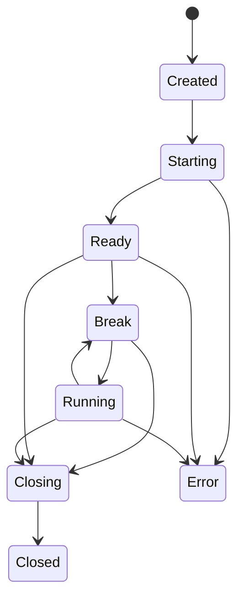

# Worker Model

DbgAtlas 接入 DbgEng/ETW/IDA 等长生命周期能力前，先按 service-managed worker 子进程设计。worker 是隔离边界和进程运行时细节，不是外部业务 API。

## 目标

- 隔离 DbgEng/COM/callback/阻塞命令对主进程的影响。
- 外部只暴露 session 生命周期；service 创建 session 时内部创建并绑定 worker。
- 同一 session 请求串行化，避免 debug engine 状态被并发命令破坏。
- 不同 session 可并发运行，各自有独立 worker 生命周期。
- 主进程可以 close、cancel 或 kill 卡死 worker，并把结果记录为 operation。
- worker 绑定在 service 管理的 Windows Job Object 下，service 退出时不应残留。

## 生命周期

`DebugSessionState` 是结构化状态，不能从 WinDbg 命令文本或 prompt 字符串里猜。worker 应显式回报状态变化、命令结果和 artifact 写入清单。

## 调用模型

- service 为每个 session 分配一个 worker 和请求队列，MVP 默认 session:worker 为 1:1。
- 同一 session 内只允许一个 command/eval/start/close 操作处于 running。
- MVP 1 的 per-session worker 持有真实 DbgEng session；`eval`、`modules`、`threads`、`stack`、`add_symbols` 和 `read_memory` 都通过同一 worker 串行执行。
- 创建 session 时调用方传入 `project_root`；service 内部懒创建 `<project_root>/dbgatlas` 并分配 `artifacts/sessions/<session_id>/`。
- 后续 eval/close/kill 等请求只携带 `session_id`，不重复传 `project_root`，也不暴露 workspace resource。
- worker 可在 service 授权的 session/domain artifact 路径下写 transcript、events、raw output 或 memory dump；service 负责登记全局 `artifacts.jsonl`、`operations.jsonl`。
- `add_symbols` 是 session 级操作，只追加当前 DbgEng session 的 symbol path；它不修改 runtime config，也不写入 workspace manifest。
- cancel 是协作式优先；超时或卡死时主进程可以 kill worker。
- worker protocol 使用内部 JSONL message；外部 service API 使用 JSON-RPC over HTTP。两者分层，不让 worker 细节泄漏到 CLI/MCP/UI。

## Recording Worker

MVP 3 增加 recording worker 概念，但仍不向外暴露 worker API。外部只看到 `recording.*` lifecycle 和 `recording_id`。

- `recording.start` 创建受控 worker，分配 `artifacts/recordings/<recording_id>/`，并启动 ETW API 采集。
- recording worker 持有 ETW session、provider enable 状态、process tree filter 和 category event writers。
- launch target 由 recording worker 或其子进程策略启动，并以 root pid 建立 process tree filter。
- attach target 从 `recording.start` 时间点开始观察，不回填历史事件。
- stop 是协作式 flush：worker 停止 ETW session，写出过滤后 `trace.etl`、`recording.json` 和 `events/*.jsonl`。
- cancel 优先协作式停止当前 operation；卡死或无法 flush 时 service 可以 kill worker，并登记 failed 或 canceled operation。
- recording worker 的 artifact 写入清单由 service 登记到全局 `artifacts.jsonl` 和 `operations.jsonl`。

## 安全约束

- worker 启动策略和 identity policy 来自 runtime config，不来自 analysis workspace manifest。
- 安装态 service 默认 LocalSystem；ETW recording 默认 LocalSystem 或 runtime config 指定的受控 identity；debug/IDA 等 user-session worker 第一版使用 active interactive session；开发态 `service run` 使用当前用户。
- dump、trace、command transcript、memory output 都按敏感 artifact 处理。
- worker 不把高层判断写成工具事实；解释层仍由人或模型在 `analysis/` 写 Markdown。
