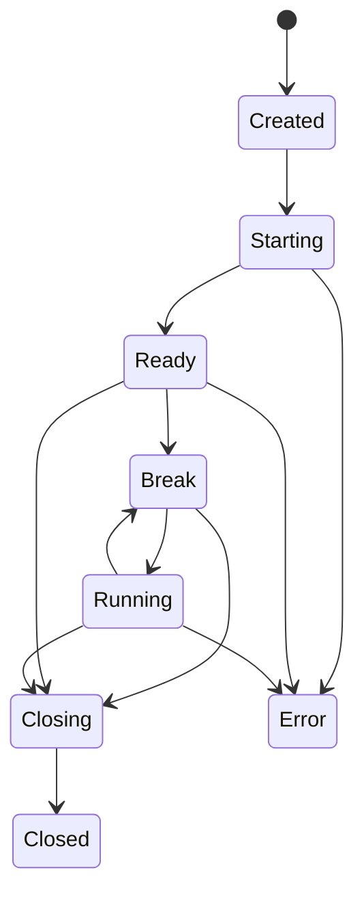

# Worker Model

DbgAtlas 后续接入 DbgEng session 前，先按 per-session worker 子进程设计。worker 是隔离边界，不是 MVP 0.5 已实现的协议。

## 目标

- 隔离 DbgEng/COM/callback/阻塞命令对主进程的影响。
- 同一 session 请求串行化，避免 debug engine 状态被并发命令破坏。
- 不同 session 可并发运行，各自有独立 worker 生命周期。
- 主进程可以 close、cancel 或 kill 卡死 worker，并把结果记录为 operation。

## 生命周期

`DebugSessionState` 是结构化状态，不能从 WinDbg 命令文本或 prompt 字符串里猜。worker 后续应显式回报状态变化、命令结果和 artifact 引用。

## 调用模型

- 主进程为每个 session 分配一个请求队列。
- 同一 session 内只允许一个 command/eval/start/close 操作处于 running。
- 请求完成后写入 `artifacts/sessions/<session_id>/` 下的 transcript、events 或 raw output，并在全局 `artifacts.jsonl`、`operations.jsonl` 登记。
- cancel 是协作式优先；超时或卡死时主进程可以 kill worker。
- worker protocol 后续可以用 JSON line，但 MVP 0.5 不固定完整 schema。

## 安全约束

- worker 启动策略来自 runtime config，不来自 analysis workspace manifest。
- dump、trace、command transcript、memory output 都按敏感 artifact 处理。
- worker 不把高层判断写成工具事实；解释层仍由人或模型在 `analysis/` 写 Markdown。
